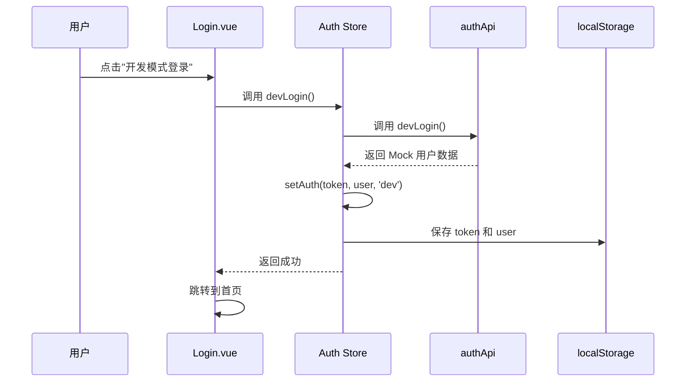

# 开发模式登录 SOP（标准操作流程）

## 📋 概述

本文档描述如何在本项目中使用和测试**开发模式登录**功能，用于本地开发和调试。

**适用场景**：
- ✅ 本地开发环境调试
- ✅ 功能测试和验证
- ✅ UI/UX 开发
- ❌ 生产环境部署（已禁用）

---

## 🚀 快速开始

### 1. 环境要求

**必须文件**：`.env.development`（已创建）

```bash
# .env.development 内容
VITE_DEV_LOGIN=true
VITE_DEV_USER=admin
```

**如果这个文件不存在**，请手动创建：
```bash
cd /Users/cherylshen/Desktop/platform
touch .env.development
```

然后编辑文件，添加上面的内容。

### 2. 启动开发服务器

```bash
cd /Users/cherylshen/Desktop/platform
npm install  # 首次运行需要安装依赖
npm run dev
```

**预期输出**：
```
VITE v5.4.21  ready in 201 ms

➜  Local:   http://localhost:5173/
➜  Network: use --host to expose
```

⚠️ **注意**：如果端口 5173 被占用，Vite 会自动切换到其他端口（如 5174、5175 等），请查看终端输出的实际地址。

---

## 🔑 开发模式登录

### 访问登录页面

1. 打开浏览器，访问 http://localhost:5173/（或实际端口）
2. 由于本地环境没有 TOF 网关，会自动显示登录页面

### 登录页面布局

```
┌─────────────────────────────────┐
│  🔒 需要登录                   │
│  请通过公司内网访问，或联系管理员 │
│                                 │
│  [ 重新检查登录状态 ]          │
│                                 │
│  ──── 开发模式 ────            │
│                                 │
│  [ 🛠️ 开发模式登录 (admin) ]  │
│  仅用于本地开发调试，生产环境已禁用│
└─────────────────────────────────┘
```

### 登录步骤

1. **观察页面**：确认看到 "开发模式" 分隔线和橙色登录按钮
2. **点击按钮**：`🛠️ 开发模式登录 (admin)`
3. **等待跳转**：系统会自动以 admin 角色登录，并跳转到首页
4. **验证登录**：
   - 右上角显示用户名：`开发用户 (admin)`
   - 可以访问所有页面（admin 有完整权限）

---

## 👤 切换用户角色

### 支持的角色

| 角色 | 权限 | 适用的测试场景 |
|------|------|----------------|
| **admin** | 完整权限（所有功能） | 测试管理员功能、系统配置 |
| **manager** | 客户经理权限（部分功能） | 测试客户经理视角 |
| **viewer** | 只读权限（查看 only） | 测试权限控制、界面展示 |

### 修改角色

1. 打开 `.env.development` 文件
2. 修改 `VITE_DEV_USER` 的值：

```bash
# 改为 manager
VITE_DEV_USER=manager

# 改为 viewer
VITE_DEV_USER=viewer

# 保持 admin（默认）
VITE_DEV_USER=admin
```

3. **重启开发服务器**（必须）：
   - 停止当前服务器（Ctrl+C）
   - 重新运行 `npm run dev`
4. 重新访问登录页面，点击开发模式登录

### 验证角色切换

登录后，检查：
- 右上角显示的角色名称是否正确
- 权限是否正确（如 viewer 无法编辑/删除）

---

## 🧪 测试流程

### 测试前准备

1. ✅ 确认 `.env.development` 文件存在且配置正确
2. ✅ 启动开发服务器
3. ✅ 能够成功登录

### 功能测试清单

#### 1. 登录功能测试

- [ ] 访问首页，自动跳转到登录页
- [ ] 点击 "开发模式登录" 按钮，成功登录
- [ ] 登录后，右上角显示正确的用户名和角色
- [ ] 刷新页面，登录状态保持（不丢失）
- [ ] 点击退出登录，成功退出，回到登录页

#### 2. 权限测试

**admin 角色**：
- [ ] 可以访问所有页面
- [ ] 可以创建、编辑、删除数据
- [ ] 可以访问系统设置页面

**manager 角色**：
- [ ] 可以访问分配的页面
- [ ] 可以编辑部分数据
- [ ] 无法访问系统设置页面

**viewer 角色**：
- [ ] 只能查看数据
- [ ] 所有编辑/删除按钮隐藏或禁用

#### 3. 路由守卫测试

- [ ] 未登录时，访问任意页面自动跳转到登录页
- [ ] 登录后，访问受权限保护的页面，根据角色正确显示或跳转
- [ ] 直接在地址栏输入 URL，路由守卫正确拦截

#### 4. 会话保持测试

- [ ] 登录后，关闭浏览器标签，重新打开，登录状态保持
- [ ] 登录后，关闭浏览器（整个程序），重新打开，登录状态保持
- [ ] 清除 localStorage，需要重新登录

---

## 🔧 开发模式实现原理

### 架构图

```
┌─────────────────────────────────────────────────────┐
│                   浏览器 (开发环境)                  │
│                                                     │
│  ┌──────────────┐        ┌──────────────┐         │
│  │  Login.vue   │        │  Auth Store  │         │
│  │  (登录页面)   │───────▶│  (状态管理)   │         │
│  └──────────────┘        └──────────────┘         │
│         │                       │                   │
│         │                       │                   │
│         ▼                       ▼                   │
│  ┌──────────────┐        ┌──────────────┐         │
│  │  authApi     │        │  localStorage│         │
│  │  (API 调用)  │        │  (持久化存储) │         │
│  └──────────────┘        └──────────────┘         │
└─────────────────────────────────────────────────────┘
```

### 关键文件

| 文件 | 作用 |
|------|------|
| `.env.development` | 开发环境配置（启用开发登录） |
| `src/views/Login.vue` | 登录页面（显示开发登录按钮） |
| `src/api/auth.ts` | 认证 API（devLogin 方法返回 Mock 数据） |
| `src/stores/auth.ts` | 认证状态管理（devLogin action） |

### 数据流



---

## ⚠️ 常见问题排查

### 问题 1：看不到开发登录按钮

**症状**：登录页面只显示 "重新检查登录状态" 按钮，没有 "开发模式" 部分

**原因**：
- `.env.development` 文件不存在或配置错误
- 开发服务器未正确加载环境变量

**解决方案**：
1. 确认 `.env.development` 文件在项目根目录
2. 确认文件内容：
   ```
   VITE_DEV_LOGIN=true
   VITE_DEV_USER=admin
   ```
3. **重启开发服务器**（必须）
4. 检查浏览器控制台，查看 `import.meta.env.VITE_DEV_LOGIN` 的值

```javascript
// 在浏览器控制台输入
console.log(import.meta.env.VITE_DEV_LOGIN)
// 应该输出: "true"
```

### 问题 2：点击登录按钮无反应

**症状**：点击 "开发模式登录" 按钮，页面无变化

**原因**：
- JavaScript 报错
- 路由跳转失败

**解决方案**：
1. 打开浏览器开发者工具（F12）
2. 查看 Console 标签页，是否有错误信息
3. 查看 Network 标签页，是否有失败的请求
4. 确认 `auth.devLogin()` 方法正确调用

### 问题 3：登录后权限不正确

**症状**：登录后，用户角色或权限不符合预期

**原因**：
- `.env.development` 中的 `VITE_DEV_USER` 设置错误
- Mock 用户数据不正确

**解决方案**：
1. 确认 `.env.development` 中的 `VITE_DEV_USER` 值正确
2. 检查 `src/api/auth.ts` 中的 `devLogin()` 方法，确认 Mock 数据正确
3. 重启开发服务器
4. 清除 localStorage，重新登录

```javascript
// 在浏览器控制台输入
localStorage.clear()
// 然后刷新页面
```

### 问题 4：刷新页面后登录状态丢失

**症状**：登录成功后，刷新页面，需要重新登录

**原因**：
- localStorage 未正确保存
- `bootstrap()` 方法未正确恢复会话

**解决方案**：
1. 打开浏览器开发者工具（F12）
2. 查看 Application > Local Storage，确认有 `sc.auth.token` 和 `sc.auth.user` 两个键
3. 检查 `src/stores/auth.ts` 中的 `bootstrap()` 方法，确认正确恢复会话
4. 查看 Console，是否有错误信息

### 问题 5：端口被占用

**症状**：启动开发服务器时，提示端口已被占用

**解决方案**：
1. Vite 会自动切换到其他端口，查看终端输出的实际地址
2. 或者手动指定端口：
   ```bash
   npm run dev -- --port 3000
   ```

---

## 📦 生产环境部署

### 重要提醒

⚠️ **生产环境禁用开发模式登录**

### 部署检查清单

- [ ] 确认生产环境**没有** `.env.development` 文件
- [ ] 确认生产构建时，`VITE_DEV_LOGIN` 环境变量**不是** `true`
- [ ] 确认生产环境只能通过 TOF 认证登录
- [ ] 确认开发登录按钮在生产环境**不显示**

### 构建生产版本

```bash
cd /Users/cherylshen/Desktop/platform
npm run build
```

构建完成后，检查 `dist/` 目录中的代码，确认不包含开发登录逻辑。

### 验证生产构建

1. 预览生产版本：
   ```bash
   npm run preview
   ```
2. 访问预览地址（通常是 http://localhost:4173/）
3. 确认登录页面**没有** "开发模式" 部分
4. 确认只能看到 TOF 认证相关提示

---

## 📝 开发最佳实践

### 1. 不要提交 `.env.development` 到代码仓库

**检查 `.gitignore`**：

```bash
# 在项目根目录查看
cat .gitignore | grep ".env"
```

**应该包含**：
```
.env
.env.development
.env.local
```

**如果不存在**，添加到 `.gitignore`：

```bash
echo ".env.development" >> .gitignore
```

### 2. 使用不同角色进行充分测试

**建议测试流程**：
1. 使用 `admin` 角色测试所有功能
2. 使用 `manager` 角色测试权限限制
3. 使用 `viewer` 角色测试只读模式
4. 每次切换角色后，**重启开发服务器**

### 3. 模拟生产环境

**本地模拟 TOF 认证**（可选）：

如果需要测试完整的 TOF 认证流程，可以：
1. 临时修改 `.env.development`，设置 `VITE_DEV_LOGIN=false`
2. 重启开发服务器
3. 确认开发登录按钮隐藏
4. 测试 TOF 认证失败的场景

### 4. 清除登录状态

**快速清除**：

在浏览器控制台输入：
```javascript
localStorage.clear()
location.reload()
```

或者手动删除 localStorage：
1. 打开开发者工具（F12）
2. 进入 Application > Local Storage
3. 删除 `sc.auth.token` 和 `sc.auth.user`

---

## 📞 技术支持

### 相关文档

- [内容更新 SOP](./内容更新SOP.md)
- [Git 部署指南](../deploy/GIT-DEPLOY-GUIDE.md)
- [WebShell 部署指南](../deploy/WEBSHELL-DEPLOY-GUIDE.md)

### 常见问题

**Q: 开发模式登录安全吗？**
A: 开发模式仅在本地环境启用，生产环境已禁用，不会影响生产安全。

**Q: 可以在开发环境测试 TOF 认证吗？**
A: 不可以。TOF 认证需要内网环境和 NGate 网关，本地开发环境无法模拟。

**Q: 开发模式登录会影响生产环境吗？**
A: 不会。通过环境变量控制，生产构建时不会包含开发登录代码。

**Q: 如何模拟不同用户的权限？**
A: 修改 `.env.development` 中的 `VITE_DEV_USER` 值，重启开发服务器。

---

## 🎯 总结

### 快速参考

| 任务 | 命令/操作 |
|------|-----------|
| 启动开发服务器 | `npm run dev` |
| 修改用户角色 | 编辑 `.env.development`，重启服务器 |
| 清除登录状态 | 浏览器控制台：`localStorage.clear()` |
| 构建生产版本 | `npm run build` |
| 预览生产版本 | `npm run preview` |

### 关键文件位置

```
/Users/cherylshen/Desktop/platform/
├── .env.development          # 开发环境配置
├── docs/
│   └── 开发模式登录SOP.md    # 本文档
├── src/
│   ├── views/
│   │   └── Login.vue        # 登录页面
│   ├── api/
│   │   └── auth.ts          # 认证 API
│   └── stores/
│       └── auth.ts          # 认证状态管理
└── package.json
```

---

**文档版本**: 1.0  
**最后更新**: 2026-05-08  
**维护者**: 开发团队
